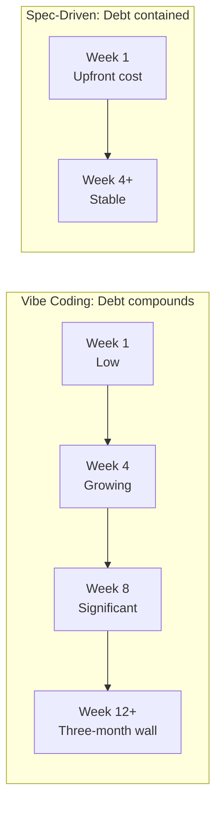
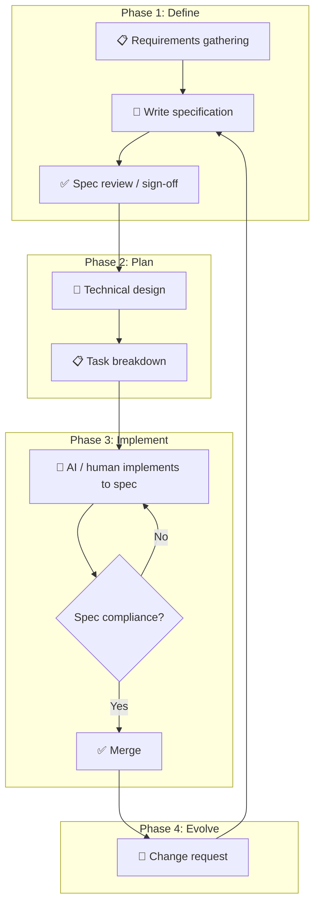
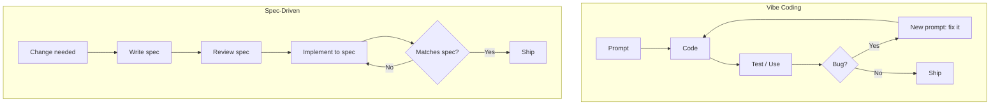
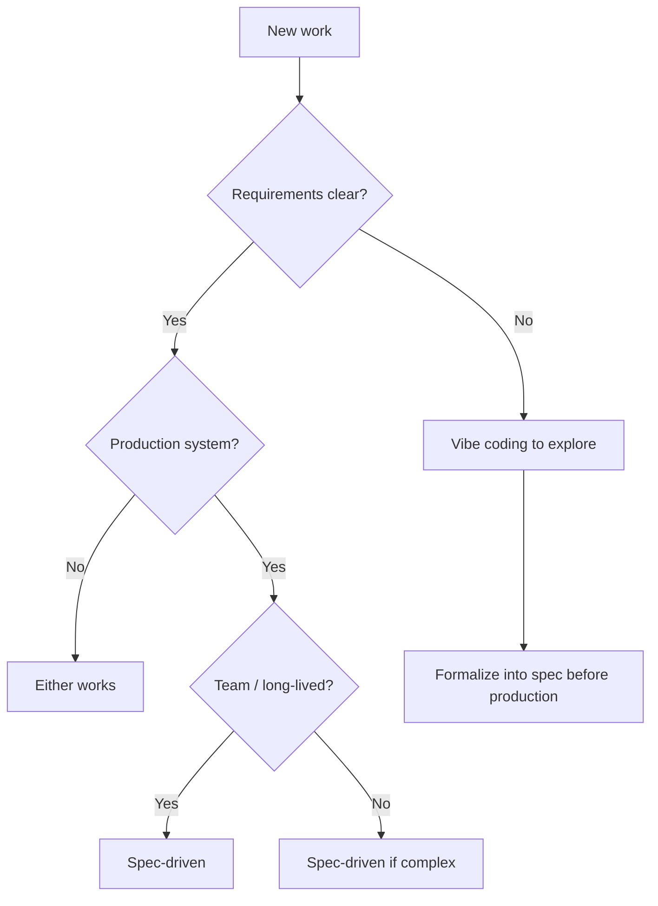
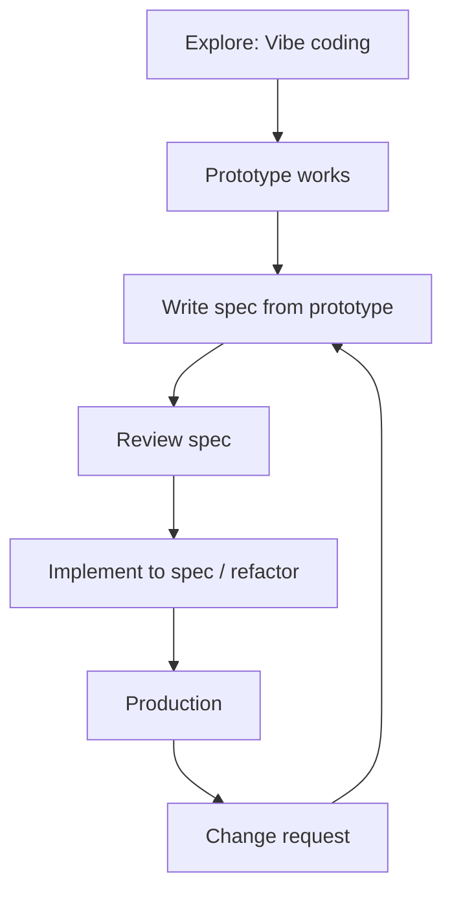

Most developers using AI coding tools fall into one of two camps: **vibe coding** (conversational, iterative, fast) or **spec-driven development** (structured, documented, traceable). Both work. Neither is universally right. But the choice has real consequences — especially when you hit the three-month wall.

This guide covers both approaches in depth, when to use each, and how to implement spec-driven development for production systems.

---

## The Two Paradigms at a Glance

| Dimension | Vibe Coding | Spec-Driven Development |
|-----------|-------------|-------------------------|
| **Entry point** | Natural language prompt → code | Written spec → implementation |
| **Planning** | Minimal or emergent | Explicit, upfront |
| **Source of truth** | The conversation | The specification document |
| **Iteration style** | "Fix this", "add that", "make it work" | Spec change → implementation update |
| **Traceability** | Low — intent lives in chat history | High — spec is version-controlled |
| **Best for** | Prototypes, exploration, demos | Production, teams, maintainability |
| **Technical debt** | Compounds quickly (documented "three-month wall") | Contained when spec is maintained |

---

## Vibe Coding: What It Is and When It Works

**Vibe coding** is the conversational, iterative approach where you describe what you want in natural language, AI generates code, you give feedback, and you iterate until it works. No formal spec. No upfront design doc. Just you, the AI, and a stream of prompts.

### The Vibe Coding Workflow

```mermaid
flowchart LR
    A[💬 "Build me a login page"] --> B[🤖 AI generates code]
    B --> C{Works?}
    C -->|No| D[💬 "Fix the validation"]
    D --> B
    C -->|Yes| E[✅ Ship it]
```

### Characteristics

- **Speed to first output**: Very fast. You can have something working in minutes.
- **Flexibility**: Easy to pivot. "Actually, make it a modal instead of a page."
- **Low friction**: No documents to write. No approval loops. Just code.
- **Context in your head**: The AI doesn't have a spec to reference — it has your prompts and the code it generated.

### When Vibe Coding Excels

- **Exploratory work**: "I'm not sure what I want yet. Let me try a few things."
- **Spikes and demos**: Proof-of-concept for a stakeholder meeting tomorrow.
- **Personal projects**: You're the only maintainer. You understand the context.
- **Learning**: Experimenting with a new library or pattern.

### The Three-Month Wall

Research and practitioner reports consistently document a pattern: vibe-coded projects hit a **"three-month wall"** where technical debt compounds. Why?



*Vibe coding: debt compounds as implicit assumptions and intent drift accumulate. Spec-driven: upfront cost, then debt stays contained when spec is maintained.*

1. **Intent drift**: Each iteration focuses on the immediate fix. The original intent gets lost. "We added this because of that bug" — but nobody wrote it down.
2. **Implicit assumptions**: The AI made choices. You accepted them. Those choices become invisible dependencies.
3. **No single source of truth**: When something breaks, you debug the code. The code doesn't explain *why* it exists. The spec would — but there isn't one.
4. **Regression surface**: Fixes in one area introduce bugs elsewhere. Without a spec, you don't have a checklist of behaviors to verify.

<Tip>
Use vibe coding to **discover** requirements. Then formalize them into a spec before production. Structured exploration: vibe first, spec second.
</Tip>

---

## Spec-Driven Development: What It Is and When It Works

**Spec-driven development** treats the specification as the single source of truth. You write what the system should do *before* you (or the AI) write code. Implementation follows the spec. Changes to behavior require spec changes first.

### The Spec-Driven Workflow



### The Four Phases

1. **Define**: Capture requirements. User stories, acceptance criteria, edge cases. Write it down. Get alignment.
2. **Plan**: Technical design. Data models, API contracts, component structure. Break into implementable tasks.
3. **Implement**: Generate or write code that satisfies the spec. AI is excellent here — it has a clear target.
4. **Evolve**: When requirements change, update the spec first. Then update the implementation. The spec stays the source of truth.

### When Spec-Driven Excels

- **Production systems**: Multiple developers, long-lived codebases, real users.
- **Enterprise contexts**: Compliance, audit trails, traceability from requirement to code.
- **Complex features**: Payment flows, auth, multi-step workflows — where mistakes are costly.
- **Onboarding**: New team members read the spec to understand intent. The code is the implementation detail.

---

## Side-by-Side: The Workflow Difference



**Vibe coding**: Prompt → Code → Feedback loop. The loop is tight. The spec is implicit.

**Spec-driven**: Spec → Implement → Verify. The loop includes a review gate. The spec is explicit and version-controlled.

---

## Spec-Driven Development In Depth

### What Makes a Good Spec

A spec that works for AI-assisted implementation has these qualities:

| Quality | What It Means | Example |
|---------|----------------|---------|
| **Concrete** | Specific enough to verify | "User can reset password via email link" not "Users should be able to recover accounts" |
| **Testable** | You can write acceptance criteria | "Given valid email, user receives reset link within 60 seconds" |
| **Structured** | Sections for behavior, data, edge cases | Requirements, Data Model, API, Edge Cases, Error Handling |
| **Traceable** | Tasks map to spec sections | Task "Implement POST /auth/reset" maps to "Password Reset Flow" in spec |

### Spec Structure Template

```markdown
# Feature: [Name]

## Overview
[2-3 sentences on what this does and why]

## Requirements
- [ ] R1: [Concrete requirement]
- [ ] R2: [Concrete requirement]

## Data Model
[Tables, types, or schema changes]

## API / Interface
[Endpoints, props, or contracts]

## Edge Cases & Error Handling
- [Edge case]: [Expected behavior]
- [Error scenario]: [How to handle]

## Acceptance Criteria
- [ ] AC1: [Testable criterion]
- [ ] AC2: [Testable criterion]
```

### Example: User Notification Preferences

**Vibe coding prompt** (typical):
```
Add a notification preferences page. Users should be able to toggle email, 
push, and in-app notifications. Save to the database. Use the existing 
settings layout.
```

**Spec-driven spec** (equivalent):

```markdown
# Feature: Notification Preferences

## Overview
Users can configure how they receive notifications (email, push, in-app) 
from the settings area. Preferences are persisted per user.

## Requirements
- R1: User can toggle email notifications (on/off)
- R2: User can toggle push notifications (on/off)
- R3: User can toggle in-app notifications (on/off)
- R4: Changes persist immediately (optimistic UI, sync on save)
- R5: Defaults: all on for new users

## Data Model
Table: user_notification_preferences
- user_id (FK, unique)
- email_enabled (boolean, default true)
- push_enabled (boolean, default true)
- in_app_enabled (boolean, default true)
- updated_at (timestamp)

## API
- GET /api/settings/notifications → returns current prefs
- PATCH /api/settings/notifications → { email_enabled?, push_enabled?, in_app_enabled? }

## Edge Cases
- Unauthenticated: redirect to login
- Invalid payload: 400 with validation errors
- DB failure: 500, show toast "Could not save. Try again."

## Acceptance Criteria
- [ ] All three toggles render and reflect current state
- [ ] Toggle change triggers PATCH, UI updates optimistically
- [ ] Page uses existing settings layout (see settings/profile)
- [ ] New user sees all toggles on by default
```

The spec-driven version gives the AI (or a human) a clear target. No guessing about defaults, error handling, or layout. The implementation can be generated with high fidelity.

### Feeding the Spec to AI

When using Cursor, Claude Code, or similar tools:

```
Implement the Notification Preferences feature according to this spec:

@specs/notification-preferences.md

Constraints:
- Follow patterns in @src/app/settings/profile/page.tsx for the page
- Use @src/components/ui/ for form components
- Add server action in @src/actions/settings.ts
- Schema changes in @src/db/schema.ts
```

The AI has the spec as context. It knows what to build. You review against the spec, not against your memory of the conversation.

---

## When to Use Which: Decision Framework



| Scenario | Recommendation |
|----------|----------------|
| Spike, demo, personal project | Vibe coding |
| Production feature, team codebase | Spec-driven |
| Requirements unclear | Vibe coding to discover → spec to formalize |
| Complex domain (payments, auth, compliance) | Spec-driven |
| Quick bug fix | Either — often vibe is fine |
| New team member onboarding | Spec-driven (spec is the onboarding doc) |

---

## The Intent Drift Problem

The core issue with vibe coding at scale isn't AI capability — it's **workflow discipline**.

```mermaid
flowchart LR
    subgraph Iteration1
        I1[Intent: "Login page"] --> I2[Code v1]
    end
    subgraph Iteration2
        I2 --> I3[Fix: "Add validation"] --> I4[Code v2]
    end
    subgraph Iteration3
        I4 --> I5[Fix: "Remember me checkbox"] --> I6[Code v3]
    end
    
    I1 -.->|Drift| I6
```

Each correction focuses on the immediate concern. The original intent ("secure login with rate limiting and audit logging") was never written down. By iteration 10, the code does things nobody explicitly asked for. The spec would have prevented that — it's the anchor.

Spec-driven development establishes **clear intent before implementation** and uses the spec as a review gate. Changes to behavior require spec updates. That discipline prevents drift.

---

## Hybrid Approach: Structured Exploration

The emerging best practice isn't "pick one." It's **structured exploration**:

1. **Explore with vibe coding**: Use conversational AI to prototype, try ideas, discover what you actually need.
2. **Capture the discovery**: When the prototype stabilizes, write down what it does. That becomes your spec.
3. **Formalize before production**: Refactor or rebuild against the spec. Version-control the spec. Use it for future changes.
4. **Evolve via spec**: When requirements change, update the spec first. Then implement.



This gives you the speed of vibe coding for discovery and the stability of spec-driven for production.

---

## Practical Checklist for Spec-Driven Development

- [ ] **Spec exists** before implementation starts
- [ ] **Spec is version-controlled** (in repo, not in Notion)
- [ ] **Tasks reference spec sections** (traceability)
- [ ] **AI receives spec as context** when generating code
- [ ] **Review checks spec compliance** — not just "does it work"
- [ ] **Change requests update spec first** — then implementation
- [ ] **New team members read spec** as primary onboarding

---

## Summary

| Approach | Strength | Weakness | Use When |
|----------|----------|----------|----------|
| **Vibe coding** | Fast, flexible, low friction | Intent drift, technical debt, no traceability | Exploration, demos, personal projects |
| **Spec-driven** | Traceable, maintainable, reduces drift | Upfront cost, slower to first output | Production, teams, complex domains |
| **Hybrid** | Best of both | Requires discipline to formalize | Most real-world projects |

The developers who thrive with AI coding tools will be the ones who know **when** to vibe and **when** to spec — and who formalize their discoveries before they compound into unmaintainable systems.

<Info>
Start with vibe coding when you're figuring out what to build. Switch to spec-driven when you're figuring out how to build it right. The spec is the bridge between exploration and production.
</Info>
